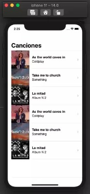
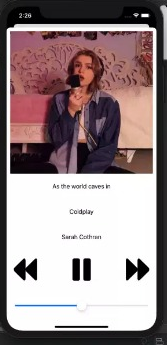

## Description

Application developed in XCode with Swift programming language, 3 songs are stored with their respective images taken from the internet for educational purposes only and to show the operation of the player, which allows the user to select the song they want to listen to.

## Author

**Alejandro Martinez**

* [LinkedIn](https://www.linkedin.com/in/diego-alejandro-martinez-espinosa-571086134)

## Screenshots 
 

## Installation

This project requires to be installed on IOS mobile devices. 

## Feedback

If you have any feedback, please reach out to us at dreamstime@outlook.es
